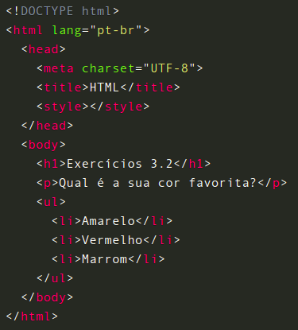

# Introdução ao CSS

#### Para fixar

index.html

1 - Modifique o tamanho do h1 para 65 pixels

2 - Modifique a cor do texto do h1 para laranja

3 - Modifique a cor de fundo da lista não ordenada

4 - Crie uma classe para modificar a cor de fundo da tag p e da ul ao mesmo tempo

Não se esqueça de dar um PUSH no seu repositório para sincronizá-lo com o GitHub

# Propriedades de texto no CSS

#### Para fixar

index.html

1 - Modifique o família do h1 para sans-serif

2 - Deixe o parágrafo com o font-weight 600

3 - Modifique o font-size do body para 16px

4 - Coloque o tamanho do parágrafo com o tamanho de 3 vezes o padrão do body

5 - Explore as propriedades font-style, line-height, text-align e text-decoration

6 - Troque a cor de fundo de cada item da lista para a cor correspondente ao texto

Não se esqueça de dar um PUSH no seu repositório para sincronizá-lo com o GitHub!

# CSS inline e externo

#### Para fixar

index.html

1 - Coloque todo o CSS criado até agora nos exercícios anteriores em um arquivo externo.

Não se esqueça de dar um PUSH no seu repositório para sincronizá-lo com o GitHub
