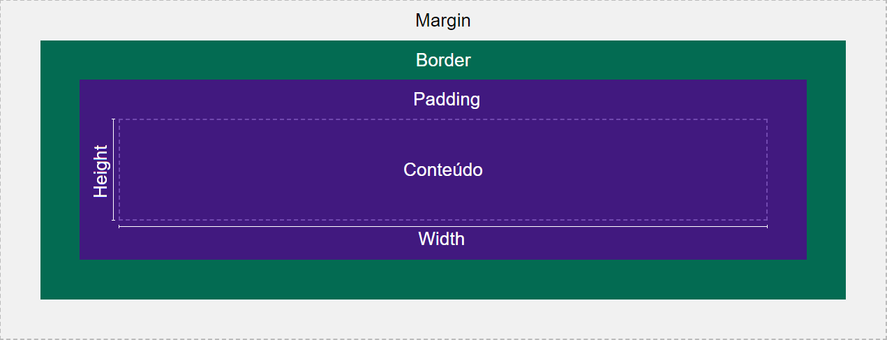
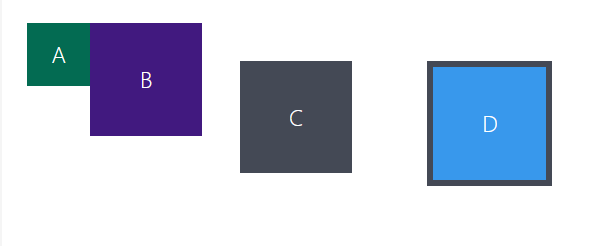

# Box Model - Modelo de caixas no CSS

Hoje nós vamos começar pela apresentação do famoso box model ou "modelo de caixas" utilizado como base do CSS. É um conteúdo fundamental para você entender como os elementos se relacionam na tela em uma página HTML renderizada no browser, preste bastante atenção!

Propriedades muito importantes do CSS são: display , overflow , height e width ! Mas você sabe porque elas fazem o que fazem?

Para ter um domínio melhor sobre o tema iremos entrar de cabeça em como funcionam os blocos do CSS que montam visualmente as páginas web e vamos aprender sobre o famoso Box Model , um dos conceitos fundamentais do CSS!

## O que é o Box Model?

A primeira coisa que temos que deixar bem explícita é que todos os elementos HTML são renderizados como caixas pelo browser. Por isso nós usamos o termo "box model" ou "modelo de caixas" quando nos referimos a essa forma de renderização e, por tabela, quando falamos de alguns elementos do layout.

Nos conteúdos desse bloco, você já utilizou HTML e CSS para criar e estilizar uma página web, então, mesmo sem saber, você já está usando o modelo de caixas para organizar o seu trabalho!

Só para exemplificar, se você utilizou a propriedade CSS background-color em algum dos elementos do seu portfólio web, você certamente percebeu que a cor de fundo foi aplicada não apenas à área diretamente atrás do elemento html, mas também em uma pequena área ao seu redor. Isso acontece porque quando você muda a cor de fundo de um elemento você está colorindo toda a caixa em que ele está contido!

O box model é composto por algumas partes que formam uma caixa para cada tag HTML que você utiliza. Essa caixa funciona mais ou menos assim:

###### Modelo de Caixas do CSS

A partir dessa imagem, vamos explicar um pouco melhor o que é cada propriedade:

#### width e height

Especificam, respectivamente, a largura e a altura da área de conteúdo, desconsiderando as bordas, margens e padding.

#### padding

Pode ser traduzido como "enchimento" e controla a quantidade de espaço vazio entre o conteúdo em si e a borda da caixa.

Ele pode ser pensado como se fosse o "plástico bolha" ao redor do conteúdo, e o seu uso, por padrão, aumenta o tamanho total do elemento, enchendo a caixa e fazendo com que ela precise ser maior que as dimensões do conteúdo.

Tenha isso em mente quando for balancear a altura e a largura, afinal, uma caixa precisa ser maior que as dimensões do conteúdo quando ele está coberto com plástico bolha, não é mesmo?

#### border

É a borda da caixa, pura e simples. A propriedade border em si é considerada uma shorthand , ou seja, ela serve como um atalho para controlar um conjunto de outras propriedades que poderiam ser definidas individualmente, nesse caso border-width , border-style , e border-color !

- border-width : também pode controlar a largura da borda e o seu valor inicial é medium .

- border-style : essa propriedade controla o estilo da linha e tem como valor inicial none . Por isso que você não consegue ver nenhuma borda se não alterar essa propriedade !

- border-color : essa propriedade controla a cor da borda, e tem como valor inicial currentcolor . Esse valor define a cor da borda como sendo o mesmo do elemento, então na maioria dos casos é desejável modificá-la.

#### margin

A margem funciona como um tipo de "campo de força" que expande o elemento para além das suas dimensões visíveis. Ela fica do lado de fora da borda e não é afetada pela estilização do elemento, servindo mais para manejar o afastamento entre as caixas. Ainda assim, não esqueça que a margem faz parte da caixa dentro do box model !

## Para fixar - Visualizando o Box Model na prática

Vamos praticar? Primeiro veja o layout de caixas abaixo:

Agora vamos reproduzir esse esquema de itens no seu browser! Copie os códigos abaixo e cole-os no seu VS Code, criando um arquivo index.html e um arquivo style.css .

Você provavelmente não conhece algumas das propriedades utilizadas nesse código, mas não tem problema: iremos trabalhá-las mais para frente! Basta se concentrar nas classes que você deve alterar de acordo com as instruções dos comentários.

index.html

style.css

Se você tiver curiosidade para saber sobre as propriedades display , text-align e vertical-align , sinta-se livre para consultar as documentações do MDN e da W3Schools . Mas não se preocupe, iremos falar melhor sobre posicionamento dos elementos em alguns instantes.

O importante é que você tenha compreendido bem como funciona o box model do CSS, que é base para todos esses assuntos! Se tiver alguma dúvida não hesite em perguntar.
