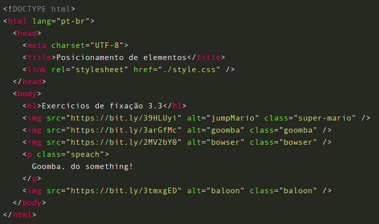
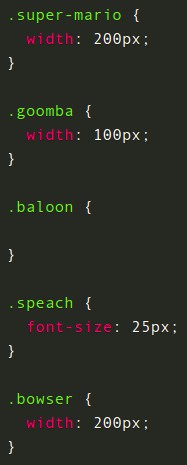

# Posicionamento de Elementos

Incrível, né? Nessa aula, é notável o quanto posicionar elementos é importante e nos abre uma gama de possibilidades para estilizar uma página, movendo elementos utilizando propriedades como top e left . Foi possível observar também a propriedade absolute , que permite posicionar qualquer elemento de acordo com o elemento pai que tenha um position diferente. E por fim, vimos o z-index , que estabelece as camadas em que o objeto irá se posicionar, e o float , que lhe possibilita empurrar um elemento para a esquerda ou para a direita da página, permitindo que outras estruturas possam se organizar em torno dele.

## Para fixar

Que tal praticarmos como manipular o posicionamento de elementos? Utilize o HTML e CSS a seguir como ponto de partida para resolver os exercícios:

index.html

style.css

Personagens pertencentes à Nintendo©

1 - Posicione o Mário acima do Goomba.

2 - Posicione a tag p para que fique dentro do balão de fala.

3 - Posicione o balão para que se torne uma fala de Bowser.
