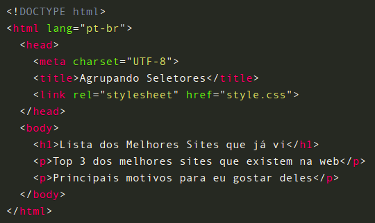
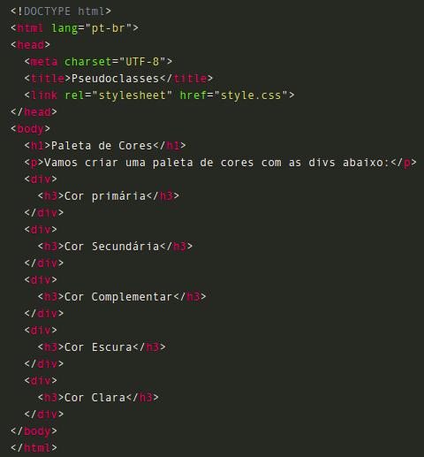

# Agrupamento de Seletores e Pseudoclasses

Você verá a seguir como agrupar seus seletores e como usar as pseudoclasses para estilizar ainda mais seu site:

Viu como podemos economizar linhas de código simplesmente agrupando estilos? Ao fazer isso, podemos corrigir rapidamente erros de estilo pela página. Imagine: você precisa criar a versão dark-theme do seu site, fazendo todos os backgrounds ficarem escuros, textos ficarem claros e estilizar os títulos. Para isso, você precisaria editar cada elemento, mas agora, basta agrupar os seletores que sofrerão as mesmas mudanças e Voilà! Tudo resolvido!

E quanto às pseudoclasses? Desde um simples :hover , para o elemento mudar quando o cursor do mouse passa por cima, até um :focus em um input de formulário, para quando o elemento estiver selecionado e puder ter um valor inserido, as pseudoclasses ajudam a estilizar melhor os elementos, dando um retorno visual ao usuário e agregando mais estilo ao seu site.

DICA: Experimente colocar a propriedade transition nos seus estilos que possuem pseudoclasses. 😉

## Para fixar I

Vamos praticar o que aprendemos.

Copie o código HTML abaixo e faça o que for pedido:

index.html

1 - Adicione uma lista ordenada dos 3 melhores sites que você conhece.

2 - Crie um arquivo no mesmo diretório e nomeie-o de 'style.css'.

3 - Nesse arquivo .css, adicione os estilos para que:

- O texto das tags 'h1' e 'p' estejam centralizados.

- A cor de fundo da sua lista mude quando o cursor estiver sobre o item.

- A fonte do item mude quando ele for clicado.

4 - Adicione uma lista não ordenada com, pelo menos, 3 características que você gosta.

5 - No 'style.css', adicione a propriedade 'list-style: none' para ambas as listas.

## Para fixar II

Para o próximo exercício, você não deve atribuir nenhuma classe ou id aos componentes, mas apenas utilizar pseudoclasses para individualizar cada elemento!

index.html

1 - Estilize as divs para que, ao passar o cursor por cima das mesmas, elas ganhem uma borda.

2 - Faça cada div ter uma cor própria.

3 - Estilize cada uma das tags h3 .

4 - Faça a terceira div ser maior que as demais.

5 - Deixe as tags ímpares h3 com o texto em itálico.
