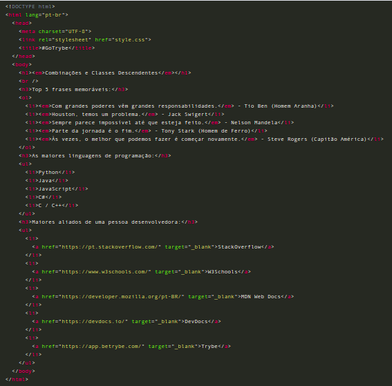

# Combinações e Classes Descendentes
Neste ponto, você já aprendeu sobre o modelo de caixas, sobre como posicionar elementos na sua página e como o agrupamento de seletores e as pseudoclasses funcionam. Agora, você dará um passo mais a fundo na dinâmica do CSS , aprendendo sobre combinações de classes em elementos HTML e também a como utilizar a descendência para aplicar estilizações à elementos específicos.

## Para fixar

E aí? Viu o quão incrível o CSS pode ser?! Agora, para fixar ainda mais o conteúdo, vamos exercitar.

index.html

Crie o arquivo style.css e resolva os seguintes exercícios:

1 - Faça com que todos os itens de Listas Ordenadas tenham uma cor de fundo amarela. Se a numeração do item for PAR, faça a cor de fonte ser verde. Se o número for considerado ÍMPAR, utilize a propriedade text-transform para deixar o texto maiúsculo. (Dica: combinar classes pode ser útil aqui).

2 - Faça todas as tags Header (h1, h2...) possuírem cor de fonte vermelha e, se alguma delas estiver em itálico, aumente seu tamanho para 40px e acrescente uma borda de 1px preta e sólida.

3 - Faça todas as li's terem 20px de tamanho de fonte e, para todo texto em itálico dentro de alguma li, utilize a propriedade font-weight para deixá-lo negrito.

4 - Na listagem de linguagens de programação, faça com que as 3 primeiras da lista possuam cor de fonte azul e, se alguma possuir "java*" no texto, utilize uma cor de fundo rosa.

5 - (Bônus) Para cada link na lista de aliados da pessoa desenvolvedora, faça com que ao passar o mouse sobre cada um, o texto fique em negrito e assuma a cor de fonte "temática do site"

- Dica 1: Utilize o seletor :hover para controlar o passar do mouse.

- Dica 2: Sugestão de cores padrão. StackOverflow (laranja), W3Schools (verde), MDN (preta), DevDocs (amarela), Trybe (verde).