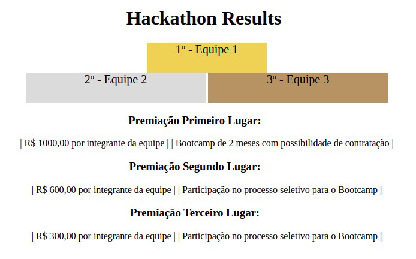
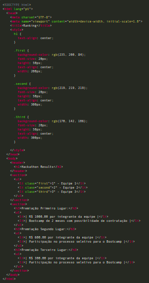

# Elementos de bloco e elementos inline

## Para fixar

Para realizar o exercício, leia atentamente o enunciado. Após entender o que foi pedido, desenvolva a solução e então verifique se você conseguiu cumprir com o que foi solicitado.

1 - Para realizar este exercício copie o código HTML abaixo. Em seguida, faça a implementação das propriedades CSS e, se necessário, faça adições à estrutura HTML existente, para que o resultado final seja similar à imagem referência.
- Lembre-se que a estrutura da página deve ser mantida para que a semântica do código seja preservada.

Podium and prizes final structure

index.html

Copiar

### Links de referência para os novos elementos semânticos do HTML 5 (Opicional)

- Apesar desses artigos possuírem uma versão em português, recomendamos que você o leia em inglês por ser mais completo. Todos os links devem ser consumidos apenas até a seção Examples .

#### Estes são alguns dos elementos semânticos que você mais utilizará em sua jornada como pessoa desenvolvedora:

- header : O elemento header representa um cabeçalho contendo texto introdutório.

- nav : O elemento nav representa um conjunto de links de navegação.

- aside : O elemento aside representa um conteúdo à parte. Alguns exemplos de sua utilização são: barras laterais e/ou conteúdos adjacentes à um conteúdo principal.

- article : O elemento article representa um conteúdo autocontido. Ou seja, todo o conteúdo presente dentro de um article provê as informações necessárias para sua compreensão, podendo ser reusado em outras páginas.

- section : O elemento section representa uma seção do documento, agrupando conteúdos relacionados.

- footer : O elemento footer representa o rodapé do documento e/ou de uma seção.