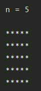
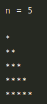
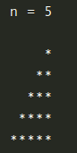
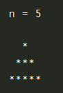

# Exercícios

## Agora a prática

### Aprofunde seus conhecimentos

Leia atentamente os enunciados e faça o que se pede!

- Recomendamos que você utilize o debugger durante a realização dos exercícios, desse modo será mais fácil acompanhar o comportamento do código e entender o que ocorre em cada uma das linhas. Para saber mais sobre como utilizar o debugger , acesse nosso conteúdo sobre isso.

1- Para o primeiro exercício de hoje, faça um programa que, dado um valor n qualquer, seja n > 1 , imprima na tela um quadrado feito de asteriscos de lado de tamanho n . Por exemplo:

Copiar

[resultado](./script1.js)

2- Para o segundo exercício, faça o mesmo que antes, mas que imprima um triângulo retângulo com 5 asteriscos de base. Por exemplo:

Copiar

[resultado](./script2.js)

3- Agora inverta o lado do triângulo. Por exemplo:

Copiar

- Atenção! Note que esse exercício é bem mais complexo que o anterior! Não basta, aqui, imprimir somente asteriscos. Você precisará de uma lógica para imprimir espaços também.

4- Depois, faça uma pirâmide com n asteriscos de base:

Copiar

