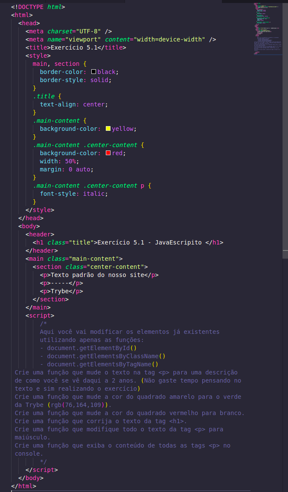

# Exercícios

## Funções de manipulação do DOM

1. É hora de aplicar seus conhecimentos em manipular os elementos do HTML !

2. A seguir, você verá um trecho de código HTML e CSS .

3. Crie um arquivo HTML dentro do diretório exercises/javascript-dom-eventos-e-web-storage_1 e copie o código a seguir.

4. Leia as instruções que estão dentro de um comentário na tag _script_ .

copiar

### [Exercícios resolvidos](./script.js)
