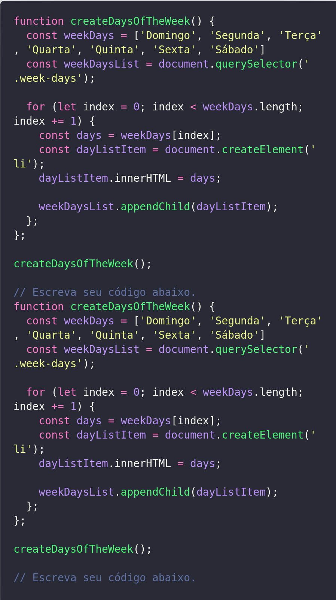

# Calendário Tryber

##### GIF Calendario Tryber.

Antes de fazer os exercícios, crie um arquivo HTML e copie o código abaixo:

Copiar

Crie também um arquivo CSS e copie o código abaixo para adicionar estilo à página. Fique a vontade para soltar a criatividade e alterar o arquivo como desejar!

Copiar

Por fim, crie um arquivo JavaScript com o nome de "script.js" e copie o código abaixo:

Copiar

O objetivo destes exercícios é colocar em prática o que você aprendeu sobre DOM, seletores, manipulação de elementos HTML e Eventos em JavaScript . Por isso, você deve fazer os exercícios utilizando apenas código JavaScript , o qual deve ser inserido no arquivo "scripts.js".

Para uma melhor organização, faça commits a cada tarefa concluída. Vamos aos exercícios:

### Exercício 1:

O array dezDaysList contém os dois últimos dias de novembro e os dias do mês de dezembro. Desenvolva uma função que crie dinamicamente cada dia do calendário e os adicione como filhos/filhas da tag `<ul>` com ID "days" . Note que os dias 29 e 30 de novembro estão no array pois representam respectivamente Domingo e Segunda-feira.

- Os dias devem estar contidos em uma tag `<li>` , e todos devem ter a classe day . Ex: `<li class="day">`3`</li>`

- Os dias 24, 25 e 31 são feriados e, além da classe day , devem conter também a classe holiday . Ex: `<li class="day holiday">`24`</li>`

- Os dias 4, 11, 18 e 25 são Sexta-feira. Eles devem conter a classe day e a classe friday . Ex: `<li class="day friday">`4`</li>`

Copiar

### Exercício 2:

Implemente uma função que receba como parâmetro a string "Feriados" e crie dinamicamente um botão com o nome "Feriados".

- Adicione a este botão a ID "btn-holiday" .

- Adicione este botão como filho/filha da tag `
` com classe "buttons-container" .

### Exercício 3:

Implemente uma função que adicione ao botão "Feriados" um evento de "click" que muda a cor de fundo dos dias que possuem a classe "holiday" .

- É interessante que este botão possua também a lógica inversa. Ao ser clicado novamente ele retorna à configuração inicial com a cor "rgb(238,238,238)" .

### Exercício 4:

Implemente uma função que receba como parâmetro a string "Sexta-feira" e crie dinamicamente um botão com o nome "Sexta-feira".

- Adicione a este botão o ID "btn-friday" .

- Adicione este botão como filho/filha da tag `
` com classe "buttons-container" .

### Exercício 5:

Implemente uma função que adicione ao botão "Sexta-feira" um evento de "click" que modifica o texto exibido nos dias que são Sexta-feira.

- É interessante que este botão possua também a lógica inversa. Ao ser clicado novamente ele retorna à configuração inicial exibindo os dias.

### Exercício 6:

Implemente duas funções que criem um efeito de "zoom". Ao passar o ponteiro do mouse em um dia do mês no calendário, o texto desse dia deve aumentar e, quando o ponteiro do mouse sair do dia, o texto deve retornar ao tamanho original.

- Dica - Propriedade: event.target .

### Exercício 7:

Implemente uma função que adiciona uma tarefa personalizada ao calendário. A função deve receber como parâmetro a string com o nome da tarefa (ex: "cozinhar") e criar dinamicamente um elemento com a tag `` contendo a tarefa.

- O elemento criado deverá ser adicionado como filho/filha da tag `
` que possui a classe "my-tasks" .

### Exercício 8:

Implemente uma função que adiciona uma legenda com cor para a tarefa criada no exercício anterior. Esta função deverá receber como parâmetro uma string ("cor") e criar dinamicamente um elemento de tag `
` com a classe task .

- O parâmetro cor deverá ser utilizado como cor de fundo da `
` criada.

- O elemento criado deverá ser adicionado como filho/filha da tag `
` que possui a classe "my-tasks" .

### Exercício 9:

Implemente uma função que adiciona um evento que, ao clicar no elemento com a tag `
` referente a cor da sua tarefa, atribua a este elemento a classe task selected , ou seja, quando sua tarefa possuir a classe task selected , ela estará selecionada.

- Ao clicar novamente no elemento, a sua classe deverá voltar a ser somente task , ou seja, esta tarefa está deixando de ser uma tarefa selecionada.

### Exercício 10:

Implemente uma função que adiciona um evento que, ao clicar em um dia do mês no calendário, atribua a este dia a cor da legenda da sua tarefa selecionada.

- Ao clicar novamente no dia com a cor da legenda, a sua cor deverá voltar à configuração inicial rgb(119,119,119) .

### Bônus:

Vamos adicionar compromissos ao seu calendário? Implemente uma função que, ao digitar um compromisso na caixa de texto "COMPROMISSOS", adiciona o item à lista "MEUS COMPROMISSOS" ao clicar no botão "ADICIONAR".

- Se nenhum caractere for inserido no campo input , a função deve retornar um alert com uma mensagem de erro ao clicar em "ADICIONAR".

- Ao pressionar a tecla "enter" o evento também deverá ser disparado.

- Dica - Propriedade: keyCode .

### [Exercícios resolvidos](./script.js)