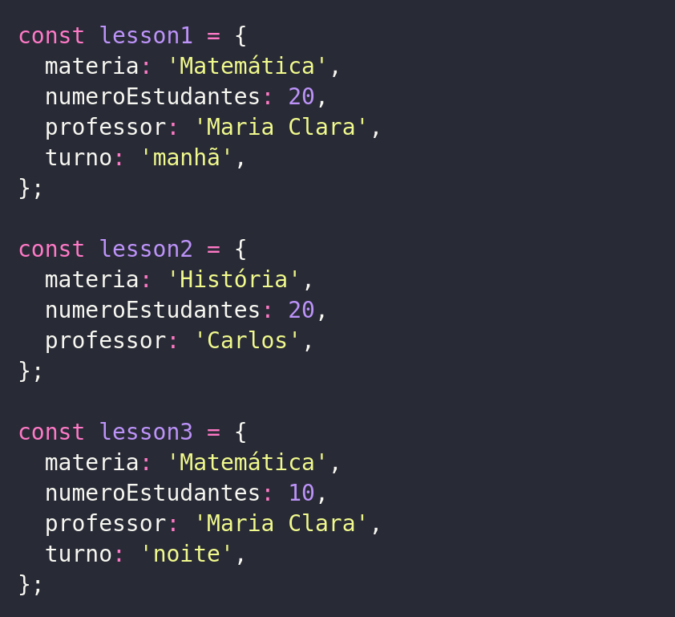
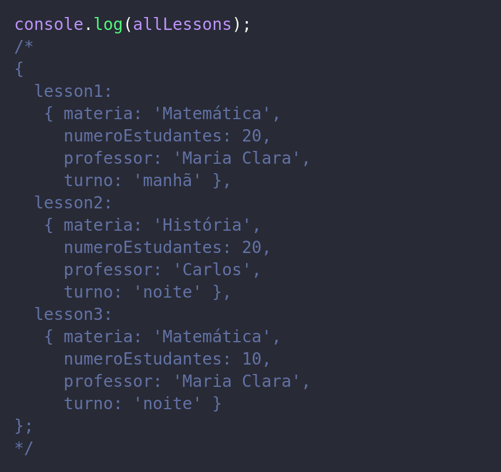

# Exercícios

## Parte I

Para os exercícios a seguir, use o seguinte código.

Copiar

Agora você vai fazer alguns exercícios de fixação.

1. Complete a função customerInfo() para que seu retorno seja similar a "Olá Ana Silveira, entrega para: Rafael Andrade, Telefone: 11-98763-1416, R. Rua das Flores, Nº: 389, AP: 701".

- Note que o parâmetro da função já está sendo passado na chamada da função.

2. Complete a função orderModifier() para que seu retorno seja similar a "Olá Luiz Silva, o total do seu pedido de marguerita, pepperoni e Coca-Cola Zero é R$ 50,00."

- Modifique o nome da pessoa compradora.

- Modifique o valor total da compra para R$ 50,00.

## Parte II

Para os exercícios a seguir, use o seguinte código.

Copiar

1. Crie uma função para adicionar o turno da noite na lesson2 . Essa função deve possuir três parâmetros, sendo eles: o objeto a ser modificado, a chave que deverá ser adicionada e o valor dela.

2. Crie uma função para listar as keys de um objeto. Essa função deve receber um objeto como parâmetro.

3. Crie uma função para mostrar o tamanho de um objeto.

4. Crie uma função para listar os valores de um objeto. Essa função deve receber um objeto como parâmetro.

5. Crie um objeto de nome allLessons , que deve agrupar todas as aulas através do Object.assign . Cada chave desse novo objeto será uma aula, sendo essas chaves: lesson1 , lesson2 e lesson3 . Ao executar o comando console.log(allLessons) , a saída deverá ser a seguinte:

Copiar

6. Usando o objeto criado no exercício 5, crie uma função que retorne o número total de estudantes em todas as aulas.

7. Crie uma função que obtenha o valor da chave de acordo com a sua posição no objeto. Por exemplo:

Copiar

8. Crie uma função que verifique se o par (chave / valor) existe na função. Essa função deve possuir três parâmetros, sendo eles: o objeto, o nome da chave e o valor da chave. Exemplo:

Copiar

