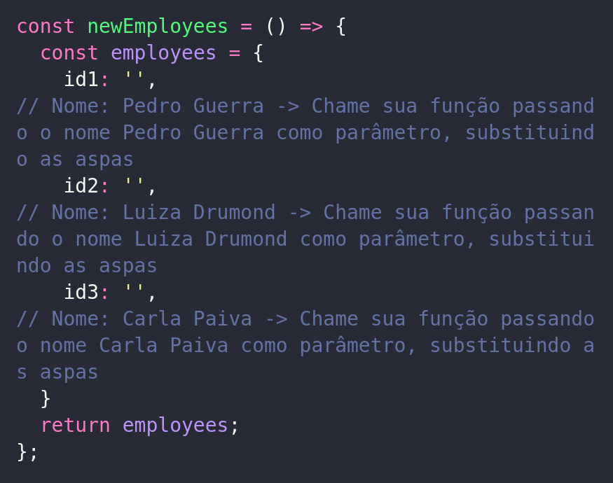

# Exercícios

## Agora a prática

1 - Crie uma função que retorne um objeto no formato `{ nomeCompleto, email }` representando uma nova pessoa contratada. Passe sua função como parâmetro da HOF newEmployees para criar cada pessoa contratada em seu respectivo id . A sua função deve receber como parâmetro o nome completo da pessoa funcionária e a partir dele gerar automaticamente um email no formato nome_da_pessoa@trybe.com .

Copiar

2 - Desenvolva uma HOF que retorna o resultado de um sorteio. Esta HOF irá gerar um número aleatório entre 1 e 5 recebendo como parâmetros o número apostado e uma função que checa se o número apostado é igual ao número sorteado. O retorno da sua HOF deve ser uma string (Ex: "Tente novamente" ou "Parabéns você ganhou").

3 - Crie uma HOF que receberá três parâmetros. O primeiro será um array de respostas corretas (Gabarito), o segundo será um array de respostas a serem verificadas (respostas da pessoa estudante) e o terceiro é uma função que checa se as respostas estão corretas e faz a contagem da pontuação final recebida pela pessoa estudante. Ao final a HOF deve retornar o total da contagem de respostas certas.

  - Quando a resposta for correta a contagem sobe 1 ponto, quando for incorreta desce 0.5 pontos, e quando não houver resposta ("N.A") não altera-se a contagem.

Copiar

