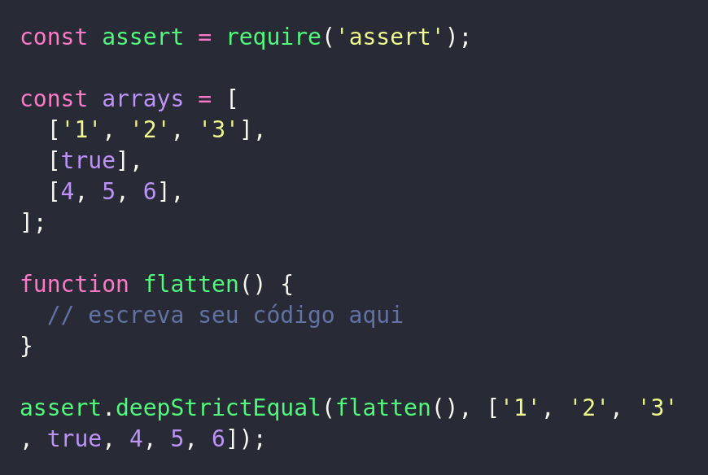
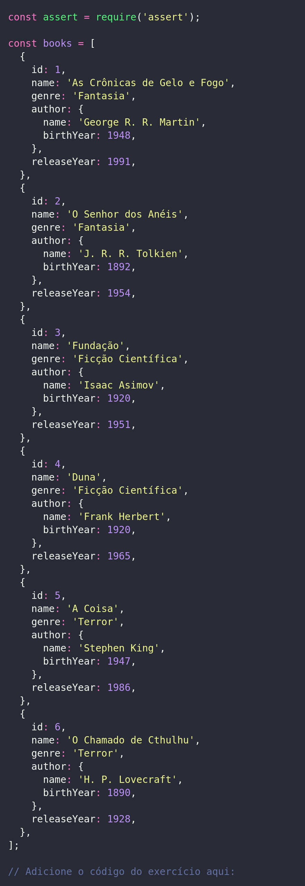
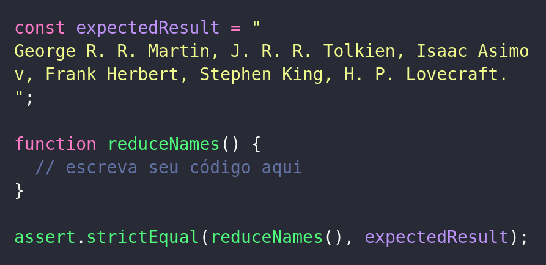
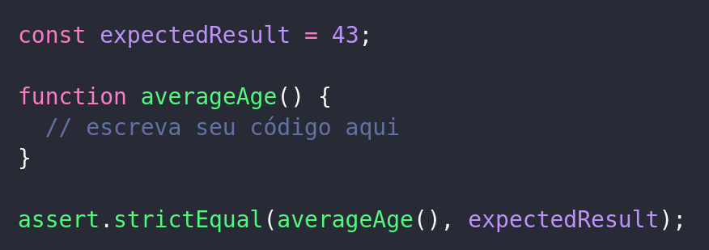
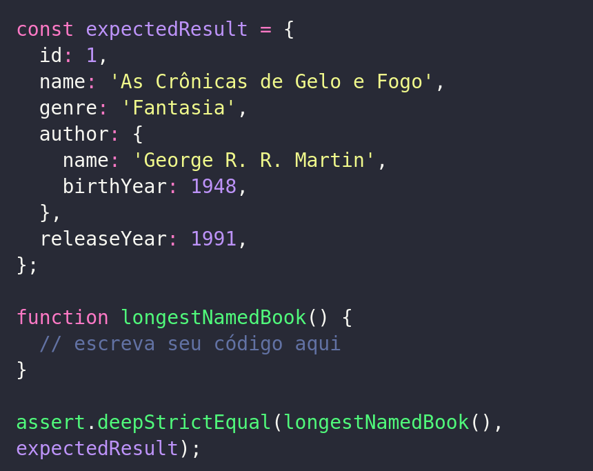
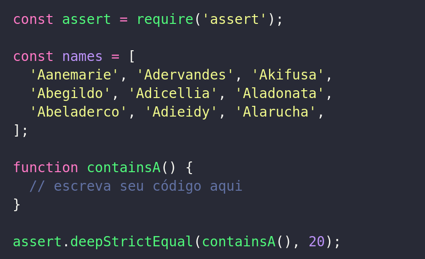
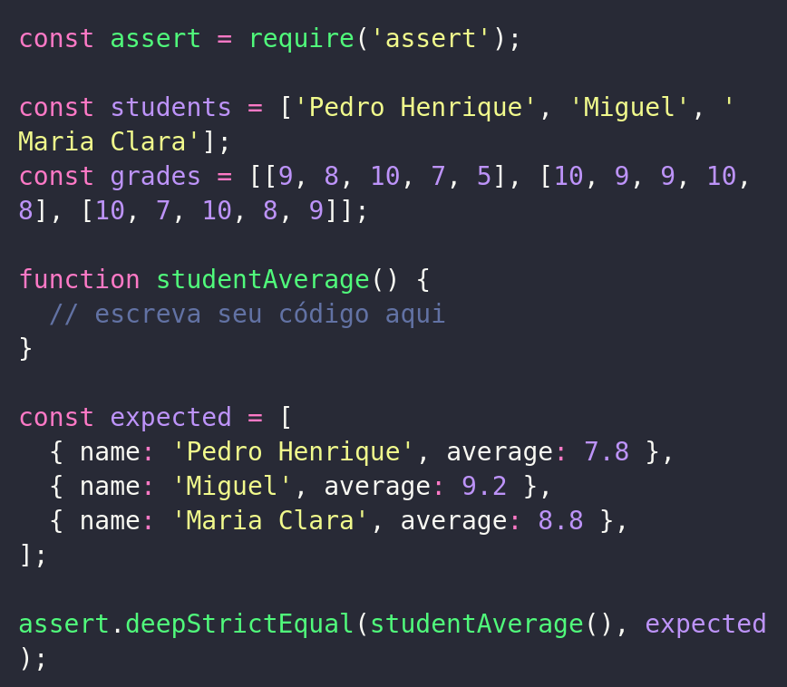

# Exercícios

## Agora a prática

Todos os exercícios devem ser realizados utilizando reduce , e se necessário outra HOF , a informação será citada no enunciado.

1 - Dada uma matriz, transforme em um array.

Copiar

### Para os exercícios 2, 3 e 4 considere o seguinte array:

Copiar

2 - Crie uma string com os nomes de todas as pessoas autoras.

Copiar

3 - Calcule a média de idade que as pessoas autoras tinham quando seus respectivos livros foram lançados.

Copiar

4 - Encontre o livro com o maior nome.

Copiar

5 - Dada o array de nomes, retorne a quantidade de vezes em que aparecem a letra a maiúscula ou minúscula.

Copiar

6. - Agora vamos criar um novo array de objetos a partir das informações abaixo, onde cada objeto terá o formato { name: nome do aluno, average: media das notas } . Para isso vamos assumir que a posição 0 de notas refere-se ao aluno na posição 0 de alunos , aqui além de reduce será necessário utilizar também a função map . Dica: Você pode acessar o index do array dentro de map , e você pode ver o objeto esperado na constante expected .

Copiar

