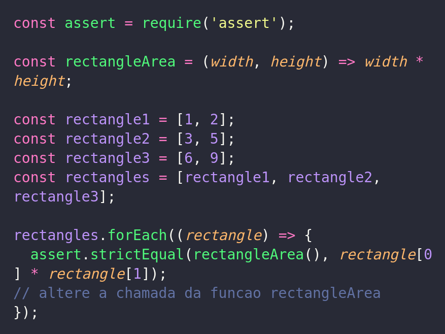
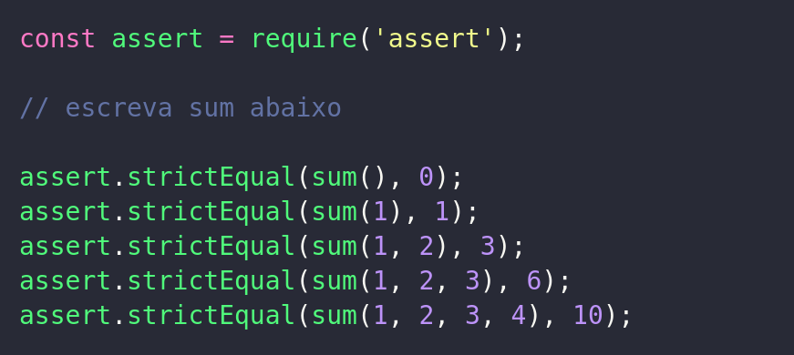
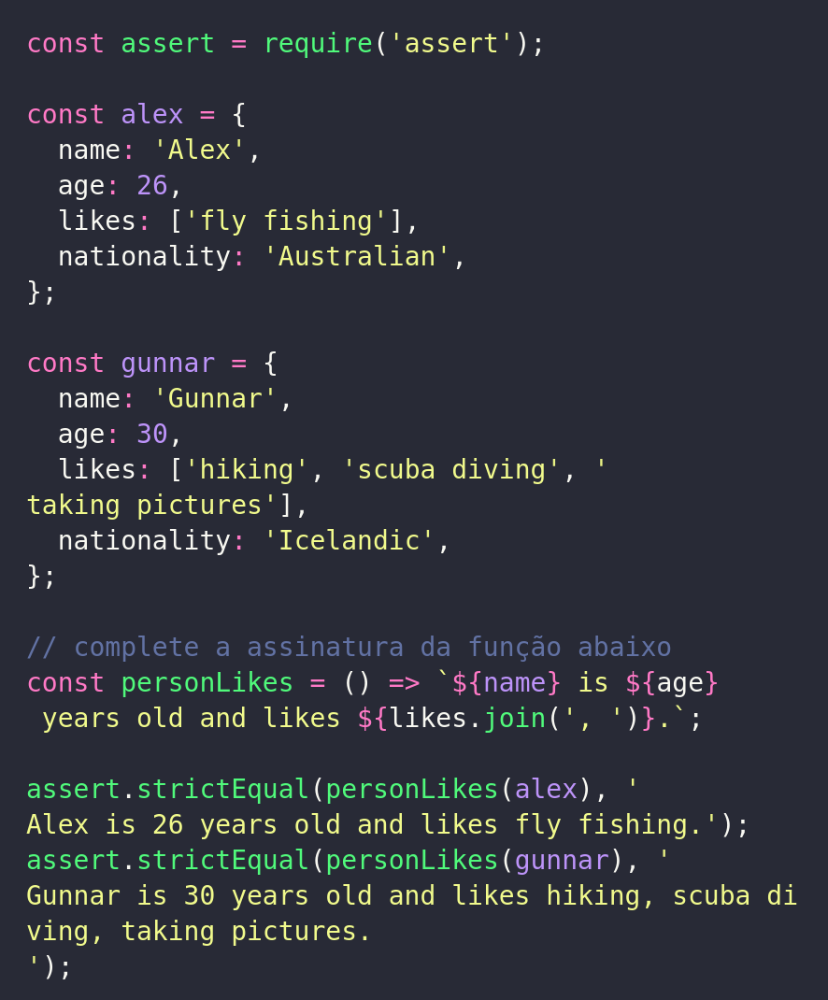
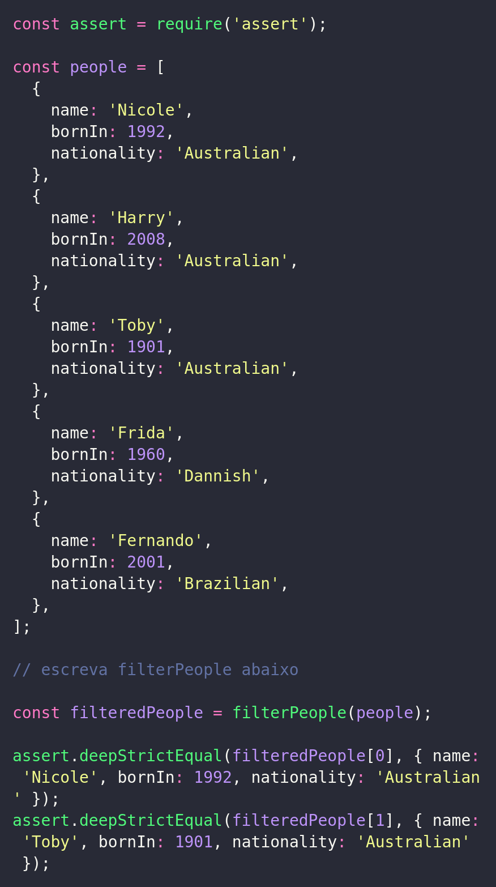
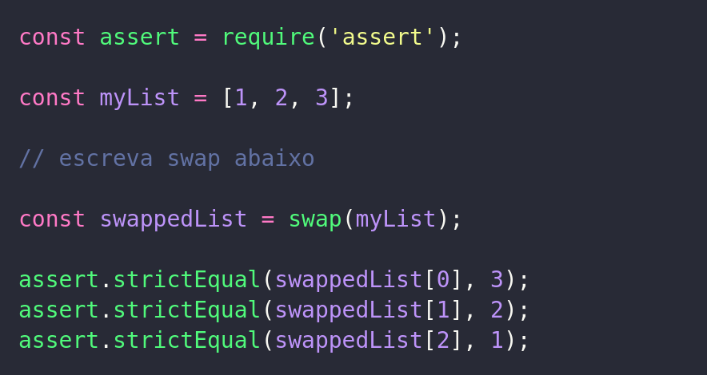
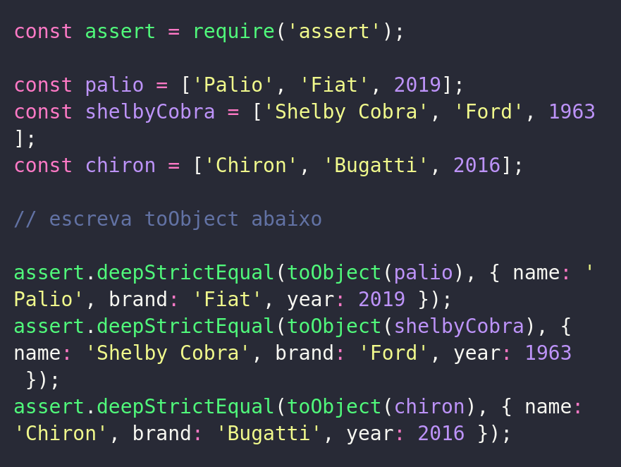
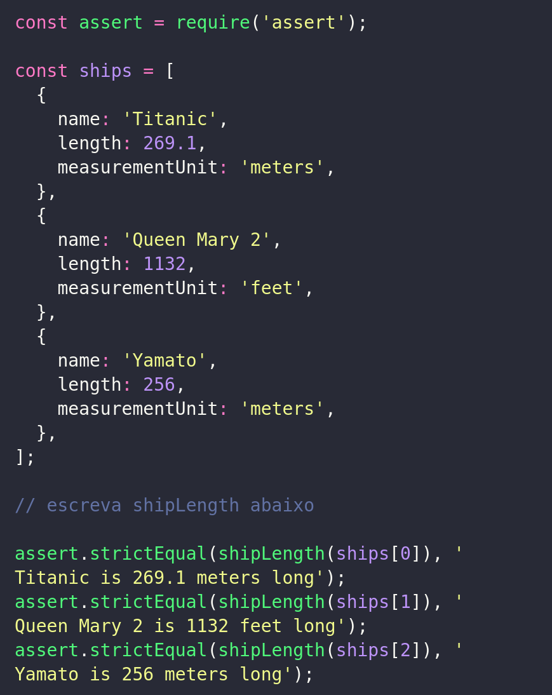
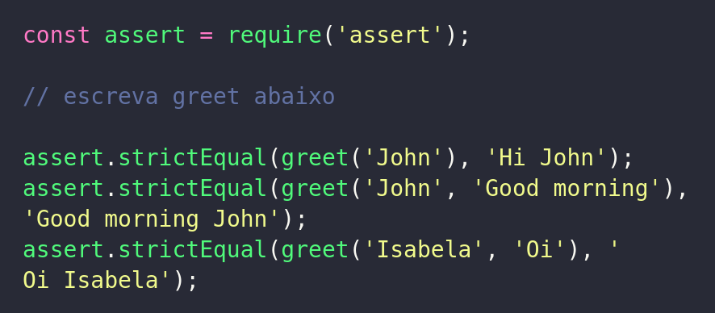

# Exercícios

## Agora a prática

1 - Dado o código abaixo, complete-o de forma que seja impressa a área dos 3 retângulos. O código deve retornar em sequência 2 , 15 e 54 .

- Dica: use spread operator .

Copiar

2 - Crie uma função sum que dado um número variável de elementos retorna a soma desses elementos. Ou seja:

- Dica: use parâmetro rest .

Copiar

3 - Escreva a função personLikes , que dado um objeto de parâmetro que representa uma pessoa, retorna todos os gostos daquela pessoa, conforme mostrado abaixo:

- Dica: use object destructuring.

Copiar

4 - Escreva uma função filterPeople que, dada uma lista de pessoas, retorna todas as pessoas australianas que nasceram no século 20:

- Dica: use object destructuring .

Copiar

5 - Escreva a função swap , que dado um array de 3 elementos, retorna um novo array com o primeiro e terceiro elementos trocados. Detalhe: você precisa fazer essa função gastando 1 linha só:

- Dica: use array destructuring .

Copiar

6 - Suponha que você esteja lidando com carros e, da forma como o problema lhe foi entregue, cada carro é modelado como um array. Porém, essa modelagem está baixo nível. Cria uma função toObject que, dada uma lista, retorna um objeto representando o carro:

- Dica: use array destructuring e abbreviation object literal .

Copiar

7 - Escreva uma função shipLength que, dado um objeto representando um navio, retorna o comprimento dele, mostrando também a devida unidade de comprimento:

- Dica: use object destructuring .

Copiar

8 - Escreva uma função greet que, dado o nome de uma pessoa, retorna uma mensagem de cumprimento:

- Dica: use default params .

Copiar

